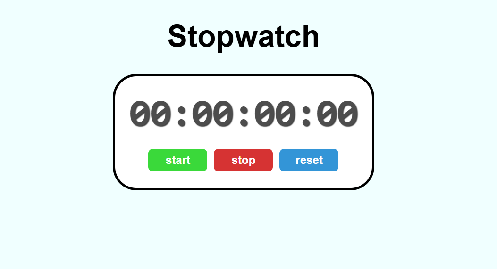

# Stopwatch ⏱️



A sleek and responsive **Stopwatch** built with **HTML, CSS, and JavaScript**.  
It allows you to **start, stop, and reset** the timer with millisecond precision.

---

## 🔗 Live Demo
[View Live Stopwatch](https://sathvik-04.github.io/Stopwatch/)

---

## 🛠 Features
- Start, stop, and reset functionality
- Displays time in **HH:MM:SS:MS** format
- Responsive and modern UI with hover effects
- Millisecond-accurate timer

---

## 🧰 Technologies Used


---

## 🚀 How to Use
1. Clone the repository:
   ```bash
   git clone https://github.com/sathvik-04/Stopwatch.git
